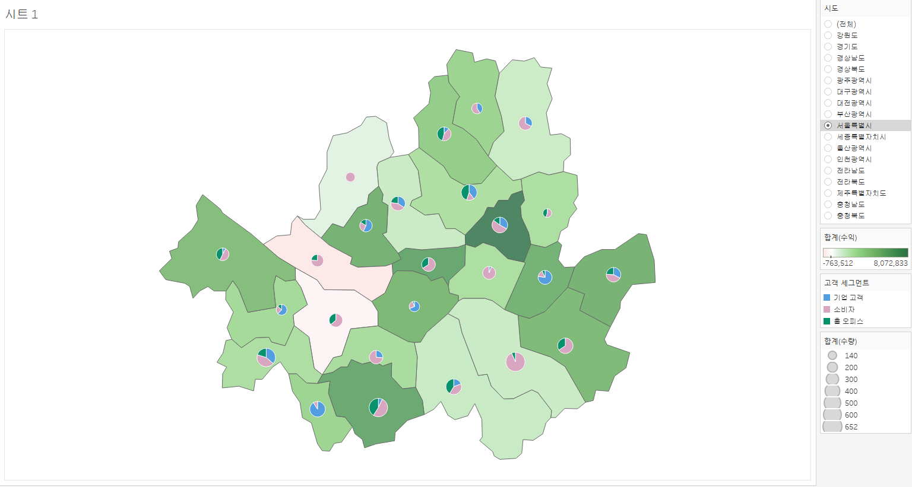

# 1. 고객별 재구매 시기 데이터 분석 태블로 시각화

이 그래프는 고객별 두 번째 구매까지 걸린 날짜(구간 단위)와 고객들의 교차 카운트를 나타냅니다. 각 막대는 특정 구간에 해당하는 고객 수를 보여주며, 높이가 높을수록 그 구간에 해당하는 고객의 재구매 비율이 높은 것을 의미합니다. 

예를 들어, 그래프에서 100일 구간에 해당하는 막대는 고객들이 두 번째 구매까지 걸린 평균 기간이 100일임을 나타내며, 교차 카운트는 25명입니다.

# 2. 고객 세그먼트 별 매출액 증강 추이 그래프

# 3. 고객 세그먼트 별 매출액 누적 막대 그래프

# 4. 년도별 매출액 영역 차트

# 5. 월별 매출액 라인 그래프 년도 비교

# 6.  지역별 매출액 합계 라운드형 막대 그래프

# 7.  평균 기준 막대 그래프

# 12. 막대 라인 그래프

# 13. 지도 파이 그래프

